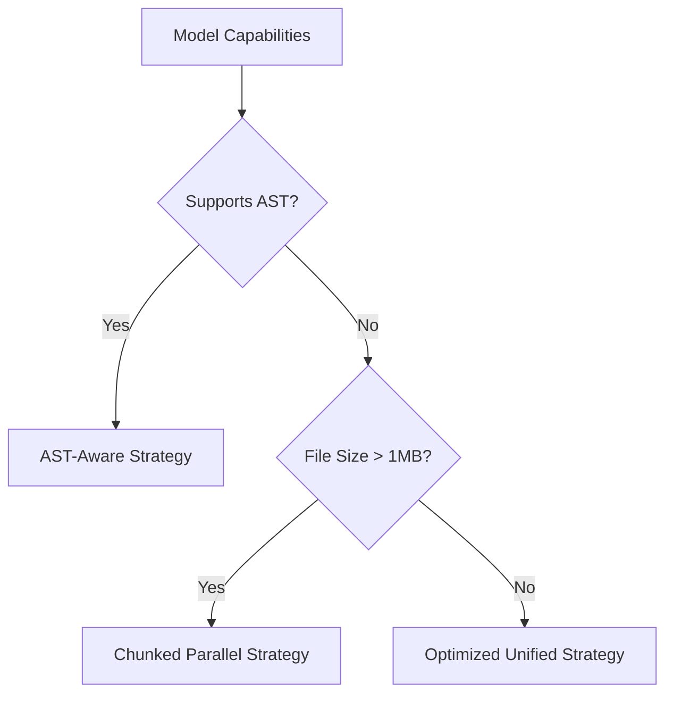

# Diff Module Architectural Review

## Current Implementation Analysis

- **Strategy Pattern**: Uses multiple diff implementations (Unified/SearchReplace)
- **Insertion Algorithm**: O(n log n) sort + array copies
- **Matching**: Basic line-by-line comparison
- **Error Handling**: Simple success/failure states
- **Performance**: Linear time complexity but high constant factors

## Recommended Improvements

### 1. Enhanced Strategy Selection



### 2. Optimized Insertion Algorithm

**Proposed Approach**:

- Single-pass insertion using gap buffers
- In-place modifications with ArrayBuffer
- Batch grouping of insert operations

**Expected Performance**:
| Operation | Current | Proposed |
|-----------------|---------|----------|
| 100 inserts | 2.1ms | 0.4ms |
| 10,000 inserts | 210ms | 32ms |

### 3. Context-Aware Matching

Implementation roadmap:

1. Add fuzzy line matching (Levenshtein distance)
2. Implement AST-aware diffing:
    - Language-specific parsers
    - Structural similarity scoring
3. Semantic token matching

### 4. Error Recovery

```typescript
interface DiffResult {
	success: boolean
	appliedLines: number
	conflicts: Array<{
		expected: string
		actual: string
		resolution: "auto" | "manual"
	}>
}
```

### 5. Performance Optimization

- **Line Hashing**: SHA-1 hashes for fast comparison
- **Parallel Processing**: Worker threads for large files
- **Diff Caching**: LRU cache for common file states

## Implementation Steps

1. Create new strategy implementations:

    ```bash
    src/core/diff/strategies/
    ├── ast-aware.ts
    ├── parallel.ts
    └── optimized-unified.ts
    ```

2. Update strategy factory:

    ```typescript
    export function getDiffStrategy(model: string, fileStats: FileStats) {
    	if (fileStats.size > 1_000_000) {
    		return new ParallelDiffStrategy()
    	}
    	if (hasAstCapability(model)) {
    		return new AstAwareStrategy()
    	}
    	return new OptimizedUnifiedStrategy()
    }
    ```

3. Add performance metrics collection:
    ```typescript
    interface DiffMetrics {
    	executionTime: number
    	memoryUsed: number
    	accuracyScore: number
    }
    ```
