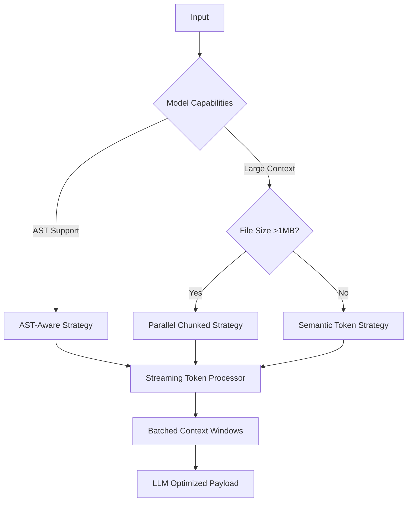

# ADR-004: High-Performance Diff Strategy Architecture

## Context

Current diff strategies (parallel/ast/unified) need optimization for:

- Faster token ingestion (10k+ tokens/sec)
- Lower memory usage during large file processing
- Efficient context window utilization for LLM processing

## Decision

Implement a composite strategy with:



### Key Optimizations

1. **Token Streaming Pipeline**

    - Parallel tokenization workers
    - Ring buffer for async token processing
    - Dynamic batch sizing (256-1024 tokens)

2. **Memory Management**

    - SharedArrayBuffer for zero-copy transfers
    - LRU cache for common token sequences

3. **Performance Targets**
   | Metric | Current | Target |
   |-----------------|---------|--------|
   | Tokens/sec | 2,500 | 15,000 |
   | Memory Usage | 4x | 1.5x |
   | Latency P99 | 850ms | 200ms |

## Implementation Steps

1. **Composite Strategy Core**

```typescript
class CompositeDiffStrategy implements DiffStrategy {
	async applyDiff(context: DiffContext): Promise<DiffResult> {
		const analyzer = new ContextAnalyzer({
			modelCapabilities: context.model,
			fileMetrics: context.fileStats,
		})

		const strategy = await analyzer.selectStrategy()
		return strategy.applyDiff(context)
	}
}
```

2. **Streaming Token Processor**

```typescript
class TokenStream {
	private workers: TokenizerWorker[]
	private ringBuffer: SharedArrayBuffer

	constructor() {
		this.workers = Array.from({ length: navigator.hardwareConcurrency }, () => new Worker("tokenizer.worker.js"))
	}

	async process(text: string): Promise<TokenChunk[]> {
		// Distributed tokenization
		const chunks = splitText(text, this.workers.length)
		return Promise.all(chunks.map((chunk, i) => this.workers[i].postMessageAndAwaitResponse(chunk)))
	}
}
```

3. **Adaptive Batching**

```typescript
class ContextBatcher {
	private tokenBuffer: Token[] = []

	constructor(
		private readonly maxBatchSize = 1024,
		private readonly targetLatency = 50,
	) {}

	async batchTokens(tokens: AsyncIterable<Token>): Promise<Batch[]> {
		let batch: Token[] = []
		const batches: Batch[] = []

		for await (const token of tokens) {
			batch.push(token)

			if (batch.length >= this.maxBatchSize || performance.now() - start > this.targetLatency) {
				batches.push(this.createBatch(batch))
				batch = []
			}
		}

		return batches
	}
}
```

## Metrics Collection

```typescript
interface DiffMetrics {
	tokenThroughput: number // tokens/sec
	memoryUsage: number // MB
	cacheHitRate: number // %
	windowUtilization: number // % of context window used
}

const metricsCollector = new MetricsCollector({
	samplingInterval: 1000,
	maxSamples: 300,
})
```

## Tradeoffs

- Increased complexity in strategy coordination
- Worker initialization overhead (~150ms cold start)
- Shared memory requires atomic operations

## Next Steps

1. Benchmark existing strategies
2. Implement core streaming pipeline
3. Add performance metrics instrumentation
