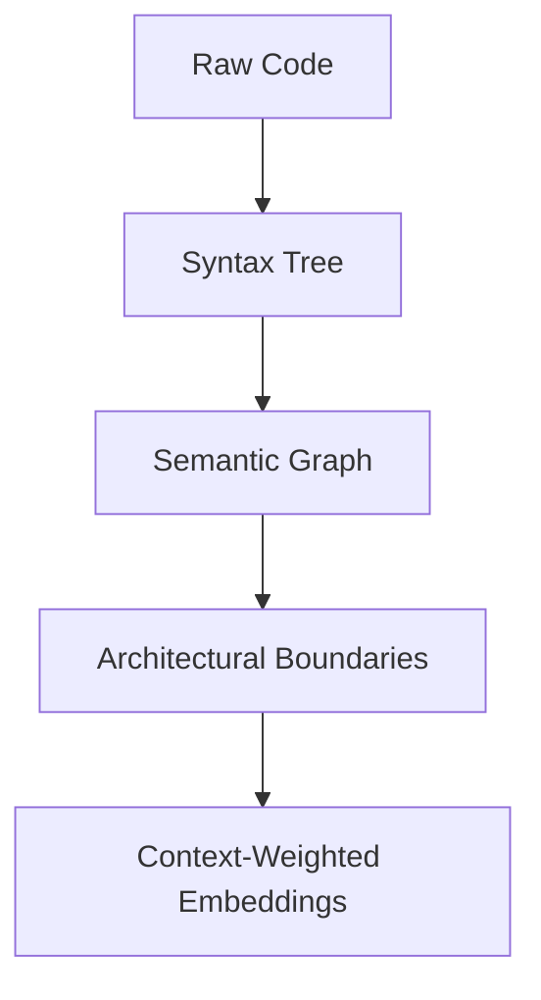
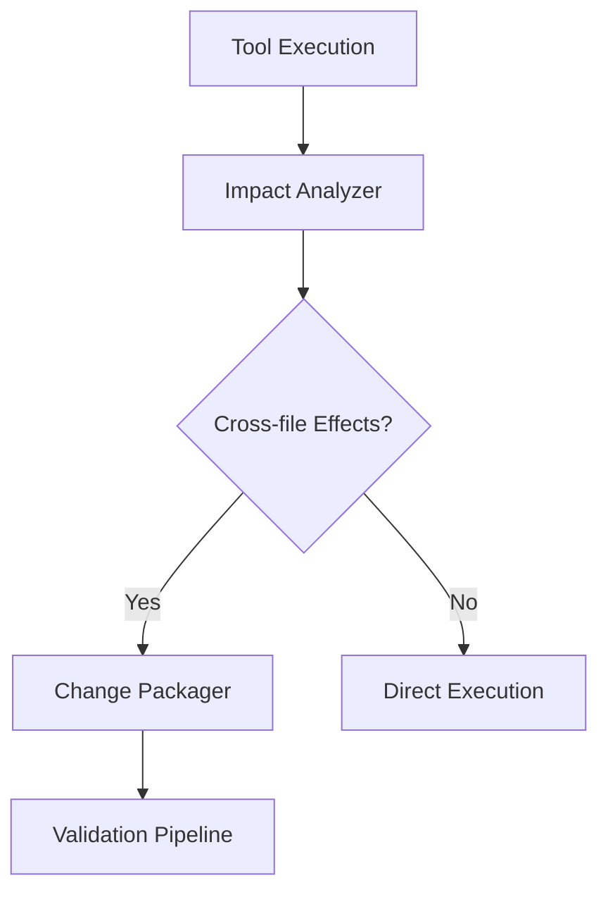
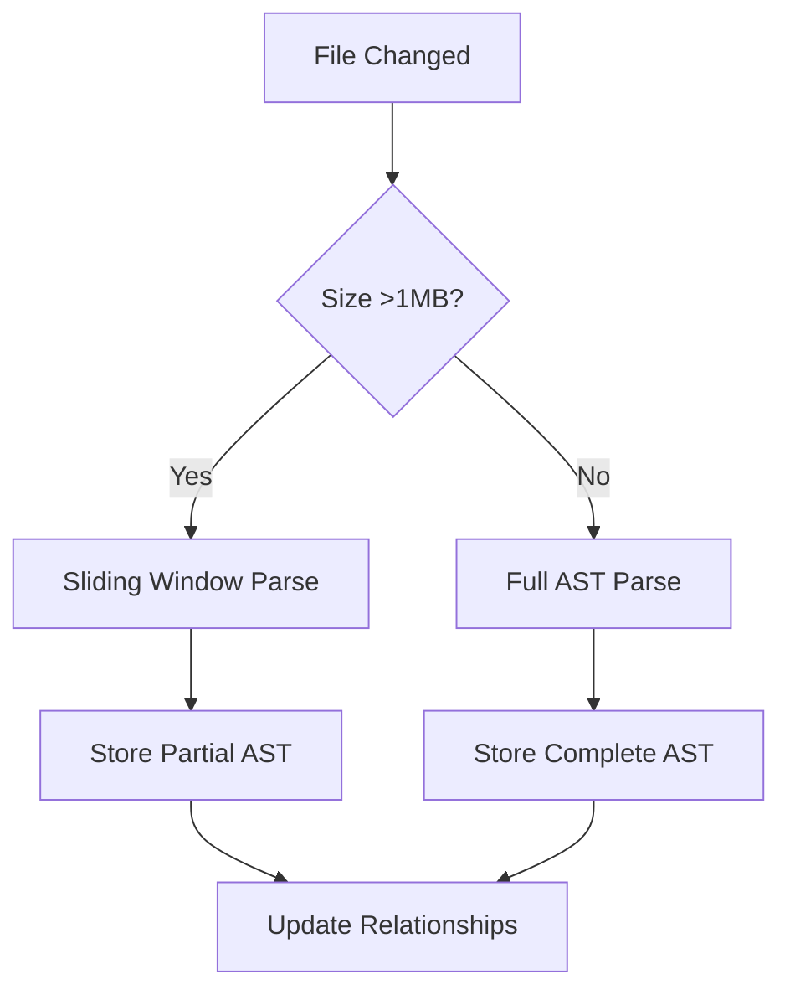

# ADR-005: Intelligent Code Editing Architecture

## Status

PROPOSED - 2025-02-03

## Context

The current code editing capabilities:

1. Lack project-wide semantic understanding
2. Handle complex refactors with basic diff strategies
3. Operate tools in isolation without coordination
4. Miss opportunities to learn from user feedback

## Decision

Implement an intelligent editing stack with enhanced context management:

> **Architectural North Star**
> "Understand code relationships first, edit precisely second"

### Context Preservation Foundation

1. **Hierarchical Chunking System**

```typescript
interface CodeChunkingConfig {
	maxFileSizeMB: number
	depthWeightedSampling: boolean
	relationshipPrioritization: {
		importDependencies: number
		typeReferences: number
		callGraphEdges: number
	}
}
```

2. **Layered Knowledge Representation**



### 3. Adaptive Context Window with Bloom Filters

```typescript
class ContextWindowManager {
	private currentFocus: CodeFocusArea
	private contextCache: Map<string, ContextSlice>
	private bloomFilter: CountingBloomFilter
	private bloomStats = new BloomMetricsCollector()

	constructor(
		config: {
			bloomFilterSize?: number
			falsePositiveRate?: number
			refreshIntervalMs?: number
		} = {},
	) {
		this.bloomFilter = new CountingBloomFilter({
			expectedItems: config.bloomFilterSize || 10000,
			falsePositiveRate: config.falsePositiveRate || 0.01,
		})

		setInterval(() => this.refreshFilter(), config.refreshIntervalMs || 300_000) // 5 minutes
	}

	private refreshFilter() {
		const newFilter = new CountingBloomFilter({
			expectedItems: this.contextCache.size * 1.5,
			falsePositiveRate: 0.01,
		})

		for (const key of this.contextCache.keys()) {
			newFilter.add(key)
		}

		this.bloomFilter = newFilter
		this.bloomStats.recordRefresh()
	}

	async getRelevantContext(target: CodePosition, config: ContextRetrievalConfig): Promise<ContextBundle> {
		// Combines:
		// - Structural proximity
		// - Semantic similarity
		// - Change history correlation

		// Track Bloom filter effectiveness
		this.bloomStats.recordQuery()
	}
}
```

### 1. Project Knowledge Graph

- AST-based dependency mapping
- Hotspot analysis
- Architectural boundary detection
- Change impact prediction

### 2. Adaptive Diff System

```typescript
interface HybridDiffStrategy {
	astDiffer: ASTBasedDiffer
	neuralPatcher: LLMPatchGenerator
	conflictResolver: MergeConflictHandler
}
```

### 3. Tool Coordination Layer



### 4. Feedback Learning Loop

- User correction tracking
- Pattern adaptation
- Threshold auto-tuning
- Micro-training on project history

## Memory-Efficient Design

**Lightweight Knowledge Graph Implementation**

```typescript
// Integrated with existing sliding window parser (src/core/sliding-window/)
class KnowledgeGraph {
	constructor(
		private slidingWindow: SlidingWindowManager,
		private maxMemoryMB: number = 512,
	) {
		// Uses 3-level storage:
		// 1. Active AST fragments in memory (≤256KB)
		// 2. Recent relationships in memory cache (≤8MB)
		// 3. Disk-backed architectural boundaries
	}
}
```

**Resource-Aware Operations**



## Consequences

- Safer large-scale refactors
- Better edit sequencing
- Context-aware tooling
- Continuous improvement

**Risks:**

- Increased memory usage
- AST parsing overhead
- Training data management

**Mitigations:**

- Limit AST depth for large files
- Use background indexing
- Configurable resource limits

## Implementation Plan

1. Add `ProjectKnowledgeGraph` class
2. Create `HybridDiffStrategy` implementation
3. Build `ToolCoordinator` service
4. Implement `FeedbackAnalyzer` module
5. Develop training harness for micro-models

```typescript
// Sample architecture integration
class EnhancedCline extends Cline {
	constructor() {
		this.knowledgeGraph = new ProjectKnowledgeGraph()
		this.diffStrategy = new HybridDiffStrategy()
		this.toolCoordinator = new ToolCoordinator()
	}
}

// Implementation Details

// 1. Enhanced Diff Strategy Interface (src/core/diff/types.ts)
interface DiffStrategy {
	applyDiff(filePath: string, diff: string): Promise<DiffResult>

	// New semantic capabilities
	analyzeSemanticImpact?(changes: string[]): Promise<SemanticImpactReport>
	resolveConflicts?(conflicts: MergeConflict[]): Promise<ResolutionResult>
}

// 2. Hybrid Implementation (src/core/diff/strategies/hybrid.ts)
class HybridDiffStrategy implements DiffStrategy {
	constructor(
		private astDiffer: AstAwareStrategy,
		private neuralPatcher: NeuralPatchGenerator,
		private conflictResolver: LLMConflictResolver,
	) {}

	async applyDiff(filePath: string, diff: string) {
		// Multi-stage diff application
		const astResult = await this.astDiffer.applyDiff(filePath, diff)
		if (!astResult.success) {
			return this.neuralPatcher.generatePatch(filePath, diff)
		}
		return this.conflictResolver.resolve(astResult)
	}
}

// 3. ML Service Integration (src/services/ml/MLService.ts)
class MLService {
	async generateSemanticPatch(context: CodeContext) {
		const prompt = this.buildPrompt(context)
		const response = await this.provider.complete(prompt)
		return this.validate(response)
	}
}

// 4. Configuration Extensions (src/core/config/ConfigManager.ts)
interface MLConfig {
	maxMemoryMB: number
	allowedProviders: string[]
	modelVersioning: boolean
}
```
