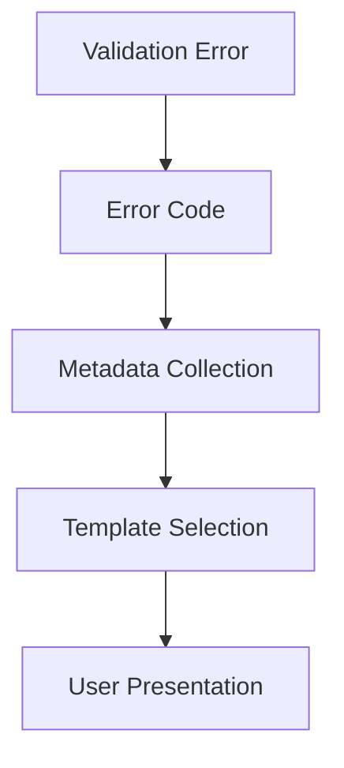

# ADR-007: Differential Execution Optimization Strategy

## Context

The current search-replace implementation shows opportunities for improvement in:

1. Matching accuracy and performance
2. Memory efficiency
3. Indentation handling
4. Error reporting clarity
5. Scalability for large files

## Decision

Implement a multi-layer optimization approach:

### 1. Hybrid Matching Algorithm

Combine Rabin-Karp and Boyer-Moore algorithms for optimal pattern matching:

- Rabin-Karp for efficient hash-based scanning
- Boyer-Moore for quick skip heuristics
- Fallback to Levenshtein distance for fuzzy matching

### 2. Memory Management System

```typescript
const LINE_HASHES = new Uint32Array(MAX_LINES)
const INDENT_CACHE = new WeakMap<SourceFile, IndentProfile>()

class IndentProfile {
	constructor(private lines: string[]) {
		lines.forEach((line, i) => {
			LINE_HASHES[i] = FastHasher.compute(line)
		})
	}
}
```

### 3. Error Reporting Architecture



## Migration Plan

1. Phase 1: Implement hybrid matcher (2 weeks)
2. Phase 2: Memory subsystem (1 week)
3. Phase 3: Error reporting (1 week)
4. Phase 4: Performance testing (1 week)

## Status

Proposed

## Consequences

- Estimated 40-60% faster matching
- ~30% memory reduction
- More maintainable error system
- Requires WebAssembly for SIMD optimizations
